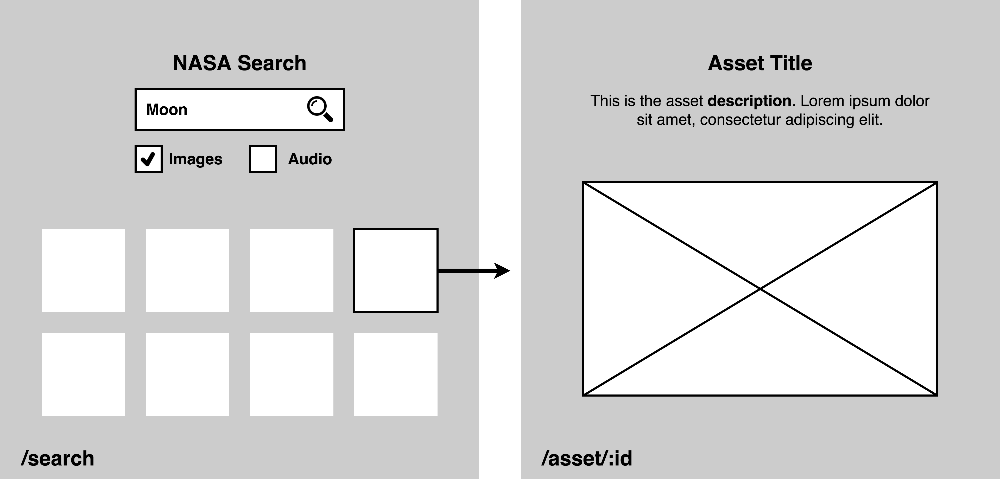

# front-end-test

## Brief
In this exercise you will develop a web application that integrates with the NASA Image and Video Library API.

It should allow users to search for assets and then select and view an asset.

## Wireframes
The following wireframes show a high-level representation of the content and user flow - we encourage you to go above and beyond what is presented, demonstrating your UX/UI as well as coding skills:




## API
Example call

```
curl -G https://images-api.nasa.gov/search \
  --data-urlencode "q=apollo 11" \
  --data-urlencode "description=moon landing" \
  --data-urlencode "media_type=image"
```

## Reference / documentation

- [https://images.nasa.gov/docs/images.nasa.gov\_api\_docs.pdf](https://images.nasa.gov/docs/images.nasa.gov_api_docs.pdf) (PDF docs)
- [https://api.nasa.gov/api.html#Images](https://api.nasa.gov/api.html#Images)
- [https://images.nasa.gov](https://images.nasa.gov)  (website)

## Tools, libraries and frameworks
The choice of tools, libraries and frameworks used to develop the application is left open but you may want to consider using a front-end framework or library to help achieve this task (e.g. React) and a simple build process (e.g. Webpack).

It should be possible to statically host the application i.e. develop a single-page application and consider publishing to GitHub Pages or AWS S3.

The application will be tested on an up-to-date version of Chrome, but it should be compatible with most modern browsers: IE11+, Chrome, Firefox and Safari.

## Assessment
We will assess the task based on the following criteria:

- How clean, modular and extensible the code is.
- Suitability of tools, libraries and frameworks used (for both the app itself and any build processes involved).
- How it looks visually and the techniques used to style the application.
- Responsive web design techniques used and the approach used for layout and accessibility.
- Testing.
- Anything above and beyond e.g. pagination, animation, routing, video playback etc.